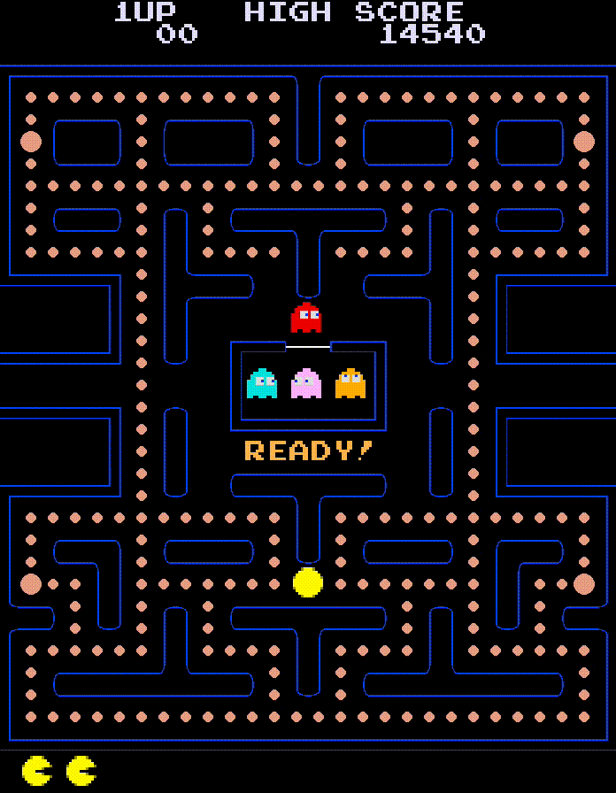
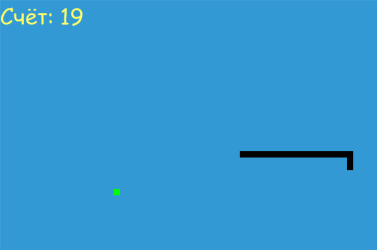
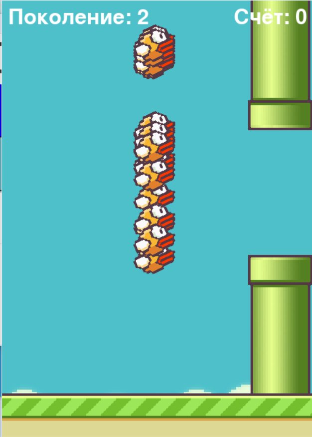

# Plasm-leaf

The 80s classic games like pacman, snake, flappy bird:)

# Pacman

The 80s classic Pacman in all its beauty, but with some features:)   

**Deployment:**
 
1. Pacman:
    1. Download the plasm-leaf-pacman folder
    2. Download Python3 [https://www.python.org/downloads/]
    3. Install tkinter [pip install tk]
    4. Install pygame [pip install pygame]
    5. In terminal, navigate to the file [main_menu.py]
    6. In terminal type [python main_menu.py] and hit enter
    7. Click the button with Pacman
 

Note: To adjust screen size change the variable "square" on line #59 of [StructFiles/game.py]

**Gameplay (delay is just an artifact of the video quality; it runs smooth):**
 

# SnakeAi

Very simple game called Snake but with Artificial Intelligence. This game used a teaching method called Q-learning or reinforcement learning.

**Deployment:**
 
1. Snake:
   1. Download the plasm-leaf-pacman folder
   2. Download Python3 [https://www.python.org/downloads/]
   3. Install tkinter [pip install tk]
   4. Install pygame [pip install pygame]
   5. Install json [pip install json]
   6. Install dataclasses [pip install dataclasses]
   7. Install itertools [pip install itertools]
   8. In terminal, navigate to the file [main_menu.py]
   9. In terminal type [python main_menu.py] and hit enter
   10. Click the button with SnakeAI
<br\>
       
 

# Flappy Bird NEAT

An unforgettable game called Flappy Bird.A lot of nerves were spent trying to beat this game, but we did it for you. The game has artificial intelligence, which is trained by a method called "NeuroEvolution of Augmenting Topologies (NEAT)" or conventional evolution. After a while, we will create an ideal AI that will pass this game and will not even waste your nerves, but you will have to endure :)

**Deployment:**
 
1. Snake:
   1. Download the plasm-leaf-pacman folder
   2. Download Python3 [https://www.python.org/downloads/]
   3. Install tkinter [pip install tk]
   4. Install pygame [pip install pygame]
   5. Install neat [pip install neat-python]
   8. In terminal, navigate to the file [main_menu.py]
   9. In terminal type [python main_menu.py] and hit enter
   10. Click the button with FlappyBirdAI
<br\>

 

